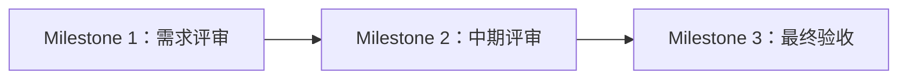

## 路线图概览

我们不再按“阶段”划分学习，而是用 **Milestone（里程碑检查点）** 驱动项目向前：每一次评审都对应明确的输入、输出与验收标准。

---

## 为什么黑客松要分三个方向？

为了让团队形成“从问题到交付”的闭环，我们把分工简化为三个方向：市场 / 产品 / 技术。了解原因与适配人群请阅读：

- [`为什么黑客松分市场/产品/技术三方向？`](/hackathon/why-three-roles)

---

## 按角色阅读（推荐入口）

如果你更关心“我这个角色应该学什么、掌握什么、怎么从初级升到高级”，请从角色视角的路线图进入：

- **市场角色**：[`市场角色学习路线`](/hackathon/role-market)
- **产品角色**：[`产品角色学习路线`](/hackathon/role-product)
- **技术角色**：[`技术角色学习路线`](/hackathon/role-tech)

> 说明：角色路线图按“初级/中级/高级”整理成长路径，并给出对应的交付标准与技能树；里程碑用于做进度检查。

---

## 里程碑入口（进度检查点）

- **Milestone 1**：[`需求评审准备清单`](/hackathon/stage-1-prep)
- **Milestone 2**：[`中期评审准备清单`](/hackathon/stage-2-deep-dive)
- **Milestone 3**：[`最终验收与交付清单`](/hackathon/stage-3-transformation)
- **总说明**：[`实战里程碑`](/hackathon/milestones)

---

## 学习双主线

| 主线 | 关注点 |
| :--- | :--- |
| **通识模块 (横向)** | AI 认知、敏捷协作方法、表达与职业素养（全员参与）。 |
| **专精模块 (纵向)** | 市场、产品、技术各方向的专业技能树（角色深耕）。 |
