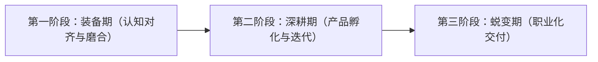

## 路线图概览

我们将课程分为三个阶段，每个阶段对应企业不同的工作场景。这不仅是技能的学习，更是职业素养的打磨。

---

## 阶段核心目标

### [第一阶段：装备期](/hackathon/stage-1-prep)
- **目标**：扫盲、磨合、工具统一。解决“这也是我们需要做的吗？”的认知偏差。
- **周期**：赛前 1-2 周。

### [第二阶段：深耕期](/hackathon/stage-2-deep-dive)
- **目标**：将一个脆弱的 Demo 打磨成 Robust Product（健壮的产品）。
- **周期**：4-8 周。

### [第三阶段：蜕变期](/hackathon/stage-3-transformation)
- **目标**：按照企业标准进行验收，完成从“学生作业”到“职业作品”的包装。
- **周期**：2-4 周。

---

## 学习双主线

| 主线 | 关注点 |
| :--- | :--- |
| **通识模块 (横向)** | AI 认知、敏捷协作方法、表达与职业素养（全员参与）。 |
| **专精模块 (纵向)** | 市场、产品、技术各方向的专业技能树（角色深耕）。 |
