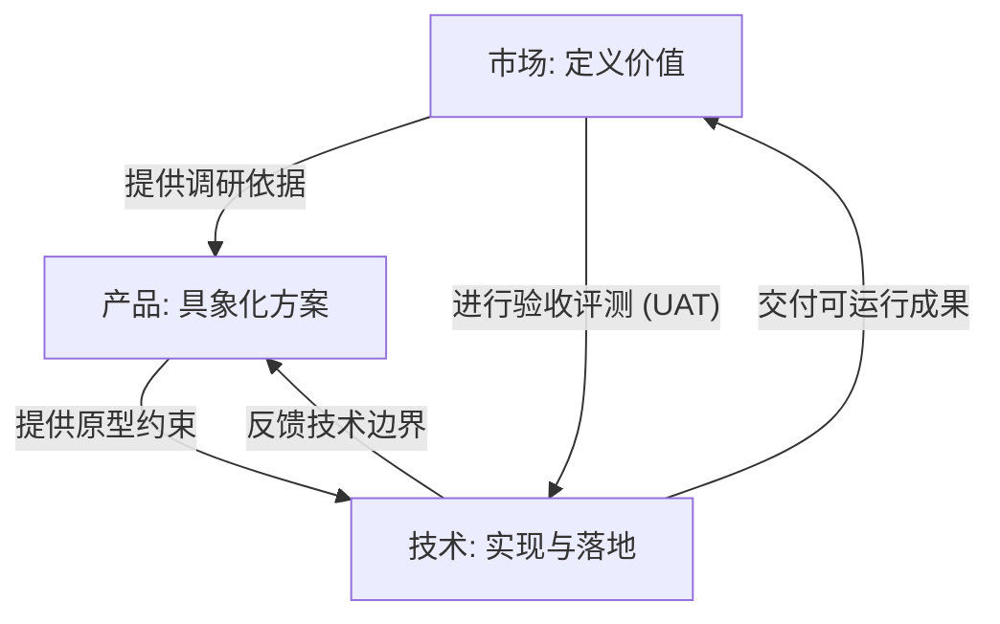

## 核心理念：三人小组

我们提倡以三人为一组，构建黑客松的**最小战斗单元 (Minimal Combat Unit)**。这种结构模拟了企业中真实的产品研发闭环：

| 角色 | 背景建议 | 核心职责 | 对标岗位 |
| :--- | :--- | :--- | :--- |
| **市场方向** | 文科/经管类 | 需求挖掘、市场调研、热点趋势分析、体验评估 | 产品运营、市场分析师 |
| **产品方向** | 设计/创意类 | 具象化设计、交互流程、用户体验、AI 交互 | UI/UX 设计师、产品经理 |
| **技术方向** | 理工科类 | 技术实施、算法落地、可行性评估、部署运维 | 开发工程师、算法工程师 |

---

## 强制互锁机制 (Interlocking)

为了防止团队协作出现“各玩各的”情况，我们引入了互锁机制：

### 互锁关键点：
1. **无调研，不产品**：产品设计必须基于市场方向提供的用户痛点与竞品数据。
2. **无原型，不技术**：技术方向的实施必须以产品方向交付的交互文档为准。
3. **无验收，不交付**：最终产出必须通过市场方向的验收评测，确保解决了最初定义的商业/社会问题。
